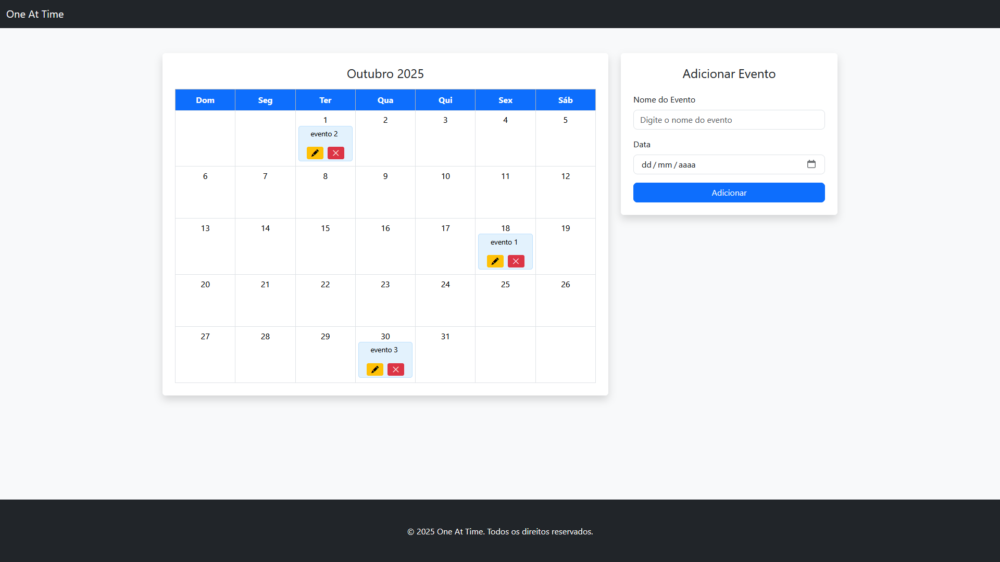

# One At Time - CRUD de Eventos

> ---
> ### Funcionalidade: CRUD - Cadastro de Eventos
> - Autor: <i>Lucas Santiago Pereira</i>
> ---

> ---
> ## ATENÇÃO
>> #### Para que o programa execute de maneira correta, é necessário estar com o JSON Server ligado **(Comando: json-server --watch db.json)**. Necessário executar esse comando na mesma pasta onde estão presentes os arquivos.
> ---

> ---
>### Função:
> ---
> - Escolher mensagem do evento
> - Escolher data do evento
> - Adicionar evento ao calendário
> - Editar evento
> - Excluir evento
> ---

> ---
>### Tecnologias: 
> ---
> - JavaScript
> - HTML
> - CSS
> - Bootstrap
> - JQuery
> - AJAX
> - JSON Server
> ---

> ---
>
>#### Imagem de exemplo da página de cadastro de enventos
> ---